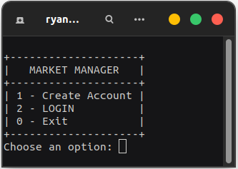
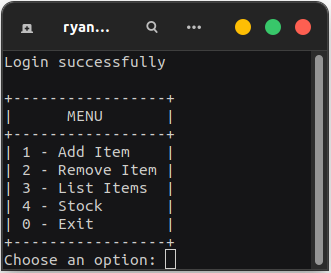
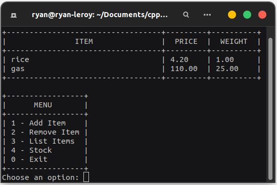
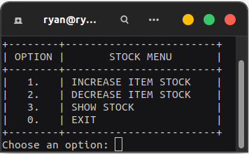
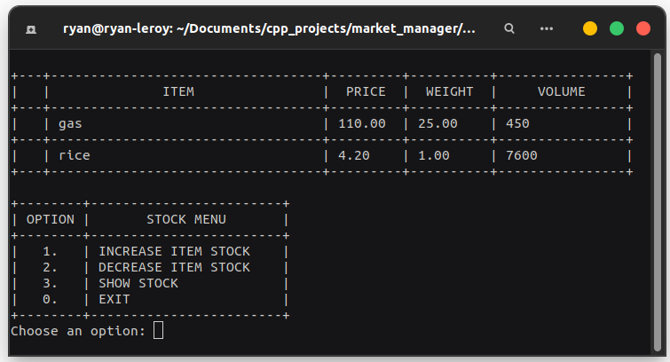

# **Market Manager** _0.0.3_
## author: Ryan Guilherme

### description: c++ developed application for manage a market system with funccionalities to add items, remove items and add/remove those items to a stock with high volumes, with account authentication.
<hr>


## **Install and execution** _(linux)_
### Only shell is required to run
### Download project files and start application:
```bash
git clone https://github.com/ryanguilherme/market_manager.git
cd market_manager/cmake-build-debug
./market_manager
```
<hr>

## **Login Screen**

### _First screen shown after start_
* option 1: _Create Account_ -> asks for a login and password with no requirements, check if the login already exists, if not, create successfully.
* option 2: _LOGIN_ -> asks for a login and password, first check if the login exists, if exists, check if the password is correct and then authenticate.
* option 0: _Exit_ -> print "Thank you for using market manager" "Exiting..." and then close the application.
<hr>

## **Main Menu**

### _First screen shown after login_
* option 1: _Add Item_ -> asks for a item name, price and weight. Check if already exists a item if this name, if not, create successfully.
* option 2: _Remove Item_ -> ask only for a item name, if exists, remove the item.
* option 3: _List Items_ -> shows a table with every item registered, with correspondent price and weight (example with a rice and gas item registered)


* option 4: _Stock_ -> go to Stock menu.
* option 0: _Exit_ -> LogOff and go back to login screen.
<hr>

## **Stock Menu**

### _Stock menu screen, shown after choose **Main menu** option 4 (show stock)_
* option 1: _INCREASE ITEM STOCK- -> list every item registered like on main menu option 3, and then ask the user to choose a item and a volume to add to the stock
* option 2: _DECREASE ITEM STOCK_ -> show the stock volume and ask for a item and volume to reduce, the item have to be added in the option 1 before
* option 3: _SHOW STOCK_ -> show the stock screen with item name, price, weight and volume (example with 450 gas and 7600 rices)


* option 0: _EXIT_ -> exit from stock menu and go back to main menu
<hr>

### **TO DO**
## move stock implementation from main.cpp to MainFunctions.h, add file system to save data


